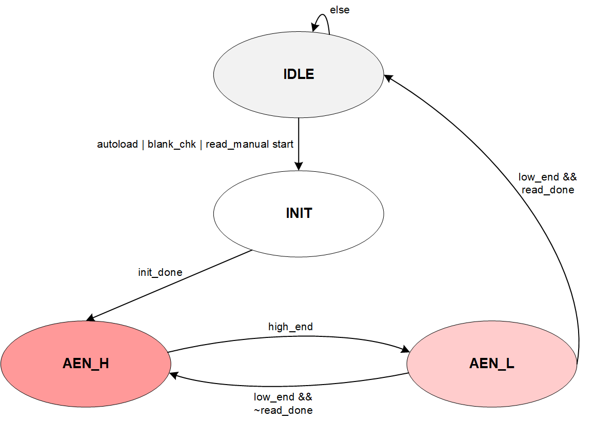
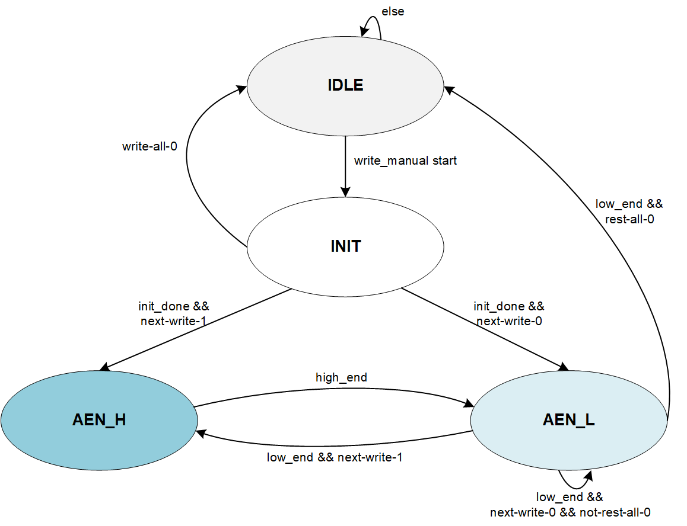

### ChelseaA EFUSE CTRL
#### 接口列表
| signal name | direction | width | comment |
| ---- | ----- |---| ---- |
| clk | input | 1 | | |
| rstn | input | 1 | | |
| scan_mode | input | 1 | | |
| pmu_efuse_start_13m | input | 1 | 上电完成后，pmu给出efuse可以开始autoload流程的使能信号 | |
| rg_efuse_refresh | input | 1 | 纯寄存器模式下的刷新信号，WC | CA 待定 |
| rg_efuse_mode | input | 2 | efuse控制模式，0：多bit读，1：多bit写，冗余待定 | |
| rg_efuse_start | input | 1 | 硬件读写efuse启动信号，WC | |
| rg_efuse_blank_en | input | 1 | 空片检测使能 | |
| rg_efuse_wdata | input | NW | WN-bit写模式的写数据 | CA中如果没有片选，一次读写256bit |
| rg_efuse_rdata | output | NR | RN-bit读模式的数据，和autoload读到第一片efuse数据（？ | CA同上 |
| rg_efuse_read_done | output | 1 | 多bit读模式完成，RO | |
| rg_efuse_write_done | output | 1 | 多bit写模式完成，RO | |
| rg_efuse_no_blank | output | 1 | efuse是否为空片，1：非空 | CA只需要1bit |
| rg_efuse_strobe_done | output | 1 | 纯寄存器模式写操作写，完成一次写返回done| strobe信号≈CA中的AEN |
| rg_efuse_password | input | 16 | 写保护，为0x55AA时才能写 | CA待定 |
| rg_efuse_trd | input | 6 | 读操作STROBE高电平时间，单位为cycle| CA中为AEN高脉宽，也叫TRD，位宽待定 |
| rg_efuse_tpgm | input | 10 | 写操作STROBE高电平时间，单位为cycle | CA同，位宽待定 |
| rg_efuse_reg_mode | input | 1 | 是否由寄存器直接控制efuse模式，高有效 | CA待定 |
| rg_efuse_pgmen | input | 1 | 纯寄存器下PGMEN | CA中 |
| rg_efuse_rden | input | 1 | 纯寄存器下RDEN | CA中AEN |
| rg_efuse_aen | input | 1 | 纯寄存器下AEN | CA中 |
| rg_efuse_addr | input | 8 | 纯寄存器下读写地址 | CA中地址译码A[7:0] |
| rg_efuse_rdata | output | 8？？？ | 纯寄存器下EFUSE返回的读数据Q | CA中一次8bit？|
| rg_efuse_dvdden | input | 1 | 纯寄存器下DVDD供电 | CA中 |
| rg_efuse_avdden | input | 1 | 纯寄存器下AVDD供电 | CA中 |
| efuse_pgmen_o | output | 1 | 输出到器件efuse | CA中有 |
| efuse_rden_o | output | 1 | 输出到器件efuse| CA中有 |
| efuse_aen_o | output | 1 | 输出到器件efuse | CA中有 |
| efuse_addr_o | output | 8 | 输出到器件efuse | CA中为地址 |
| efuse_rdata | input | 8 | 器件efuse给出的读数据 | CA中有，位宽待定 |
| efuse_dvdden_o | output | 1 | 输出到器件efuse | CA中有 |
| efuse_avdden_o | output | 1 | 输出到器件efuse | CA中有 |
| efuse_autoload_done | output | 1 | 上电后efuse完成autoload标志，电平，有时钟就会一定能拉高 | CA中保留 |
| efuse_autoload_vld | output | 1 | 上电后efuse完成autoload的有效标志，脉冲，控制reg_ctrl刷新对应autoload的寄存器 | CA中保留 |
| efuse_busy | output | 1 | efuse处于读写状态标志，1：忙碌 | CA中保留 |

#### 工作流程
##### 上电Autoload流程
1. 上电复位时，信号全初始化到Inactive状态；
2. 复位后，PMU产生pmu_efuse_start_13m，此时EFUSE进入autoload流程
   - is_autoload拉高，直到autoload结束
   - 复位释放后efuse_busy拉高，直到autoload结束
   - read_start有效-->READ模块
3. READ模块按照时序产生EFUSE控制信号给器件，开始autoload，每读出NR-bit数据，READ模块都会收到read_done，数据加载到efuse_autoload_data寄存器，再读下一坨；
4. 当EFUSE中256bit数据全都load完后，产生efuse_load_vld脉冲，给reg_ctrl更新相关寄存器
5. 读完后检查efuse是否为空片，并更新空片状态寄存器，拉高efuse_autoload_done标志；
6. 读完后信号都恢复到Inactive状态；

##### 硬件写流程(Burn)
1. 上电完成autoload流程后，（用户？）读取到efuse_autoload_done寄存器为1后，（用户？）读取rg_efuse_no_blank是否为0，判断空片；
2. 调整电压，产生efuse_avdden_o给EFUSE(疑问？这个是efuse_ctrl产生还是用户配置)
3. 配置写保护寄存器rg_efuse_password（Bs中有）
4. 配置操作模式：rg_efuse_mode=1（写入）
5. 配置要写入的NW-bit数据：rg_efuse_wr_data；
6. 启动写操作：rg_efuse_start W1C；
7. 查询rg_efuse_write_done拉高后表示NW-bit写操作完成；
8. 如果继续burn，重复<5-7>；
9. burn结束后所有信号恢复Inactive状态；

##### 硬件读流程
1. 检查当前是否可以进行读操作，上电后等待efuse_autoload_done/burn后等待rg_efuse_write_done；
2. 配置读操作模式：rg_efuse_mode=0
3. 启动读操作：rg_efuse_start W1C；
4. 查询rg_efuse_read_done拉高后表示NR-bit读操作完成，获得NR-bit读数据rg_efuse_rd_data；
5. 如果继续burn，重复<3-4>；
6. 读结束后所有信号恢复Inactive状态；

##### 寄存器下的写操作
即所有PGMEN/RDEN/AEN/A都直接用寄存器控制，要写入的数据为1时AEN启动；
由于Cardiff Bs中STROBE（AEN）无法通过spi配置寄存器完成相应时序控制，因此该信号通过硬件自己产生(strobe_create模块)-->半寄存器控制（需要额外配置rg_efuse_refresh—）
1. 上电完成autoload流程后，（用户？）读取到efuse_autoload_done寄存器为1后，（用户？）读
取rg_efuse_no_blank是否为0，判断空片；
2. 调整电压，产生efuse_avdden_o给EFUSE(疑问？这个是efuse_ctrl产生还是用户配置)
3. 配置寄存器操作模式：rg_efuse_reg_mode=1；
4. 对rg_efuse_refresh做W1C，清空内部状态寄存器（？？？？？？
5. 配置对应的内部临时寄存器：rg_efuse_pgmen_tmp=1，rg_efuse_rden_tmp=0，以及要写入的数据rg_efuse_wr_data；
6. 配置要读取数据的地址：rg_efuse_addr_tmp=xx；
7. 对rg_efuse_refresh做W1C，刷新并同步寄存器；
8. 随后配置rg_efuse_aen_tmp=1，再次对rg_efuse_refresh做W1C，刷新并同步寄存器；
9. 等待一段时间后(TPGM),配置rg_efuse_aen_tmp=0，再次对rg_efuse_refresh做W1C，刷新并同步寄存器；
10. 如果要继续写操作，重复<6-10>；如果无需继续写入，配置rg_efuse_pgmen_tmp=0，rg_efuse_rden_tmp=0，rg_efuse_addr_tmp=0，再次对rg_efuse_refresh做W1C，刷新并同步寄存器，结束写操作，回到Inactive状态；
11. 配置rg_efuse_reg_mode=0，退出寄存器模式；
12. 断电或者调整efuse电压到读状态；

##### 寄存器下的读操作
即所有PGMEN/RDEN/AEN/A都直接用寄存器控制，读出的D也直接送给RO寄存器；
1. 检查当前是否可以进行读操作，上电后等待efuse_autoload_done/burn后等待rg_efuse_write_done；
2. 配置寄存器操作模式：rg_efuse_reg_mode=1；
3. 配置对应的内部临时寄存器：rg_efuse_pgmen_tmp=0，rg_efuse_rden_tmp=1，以及要写入的数据rg_efuse_wr_data；
4. 配置要读取数据的地址：rg_efuse_addr_tmp=xx；
5. 将配置刷新到控制寄存器：对rg_efuse_refresh做W1C，刷新给到EFUSE器件，并且此时reg_ctrl同步更新了rg_efuse_pgmen/rden/addr/aen信号（保证同步变化）；
6. 随后配置rg_efuse_aen_tmp=1，再次对rg_efuse_refresh做W1C，刷新并同步寄存器；
7. 等待TSQ时间后，读取数据输出到rg_efuse_rdata；
8. 随后配置rg_efuse_aen_tmp=0，再次对rg_efuse_refresh做W1C，刷新并同步寄存器；
9. 如要读取下一个8bit，重复<4-8>；如果无需读取，配置rg_efuse_pgmen_tmp=0，rg_efuse_rden_tmp=0，rg_efuse_addr_tmp=0，再次对rg_efuse_refresh做W1C，刷新并同步寄存器，结束读操作，回到Inactive状态；
10. 配置rg_efuse_reg_mode=0，退出寄存器模式；

